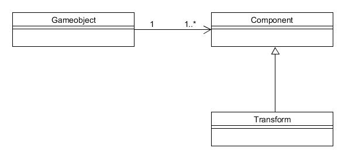

# Homework_1

<!--more-->

## 基础概念

1. 解释游戏对象(GameObjects)和资源(Assets)的区别与联系。
    + 区别
      + 游戏对象(GameObjects)
          >游戏中的每一个对象都是一个游戏对象。他们本身不会做任何事情，我们赋予他们各自的属性之后，就成为了我们在游戏中看到的角色或环境等。
          >
          >可以将游戏对象比喻成一个空容器，再向其加入其中的组件和赋予其的属性后，它变得与其他游戏对象不同
      + 资源(Assets)
          >资源有很多，比如对象、材质、场景、声音、预设、贴图、脚本和动作资源。这些资源可以在项目打开时，被导入到游戏里。可以被游戏对象使用，也可以被实例化为游戏对象。
    + 联系
        > 资源被导入到游戏中，与游戏对象相互配合以此完成相应功能。

1. 编写一个代码，使用 debug 语句来验证 MonoBehaviour基本行为或事件触发的条件
    + 基本行为包括 Awake() Start() Update() FixedUpdate() LateUpdate()
    + 常用事件包括 OnGUI() OnDisable() OnEnable()

    ```cs
    public class NewBehaviourScript : MonoBehaviour {
        // 限制 update 的输出次数
        private int UpdateTest;
        private int OnGuiTest;
        private int FixedUpdateTest;
        private int LateUpdateTest;

        void Start () {
            UpdateTest = FixedUpdateTest = 0;
            OnGuiTest = LateUpdateTest = 0;
            Debug.Log("Start");
        }

        void Update () {
            if (UpdateTest != 3) {
                Debug.Log("Update");
                UpdateTest += 1;
            }
        }

        private void Awake() {
            Debug.Log("Awake");
        }

        private void FixedUpdate() {
            if (FixedUpdateTest != 3) {
                Debug.Log("FixedUpdate");
                FixedUpdateTest += 1;
            }
        }

        private void LateUpdate() {
            if (LateUpdateTest != 3)
            {
                Debug.Log("LateUpdate");
                LateUpdateTest += 1;
            }
        }

        private void OnGUI() {
            if (OnGuiTest != 3) {
                Debug.Log("OnGUI");
                OnGuiTest += 1;
            }
        }

        private void OnDisable() {
            Debug.Log("OnDisable");
        }

        private void OnEnable() {
            Debug.Log("OnEnable");
        }
    }
    ```

1. 查找脚本手册，了解 GameObject，Transform，Component 对象
    + 分别翻译官方对三个对象的描述(Description)
        1. GameObject
            + GameObjects are the fundamental objects in Unity that represent characters, props and scenery.
            + 游戏对象是在 Unity 中代表任务，道具和场景的基础对象
        1. Transform
            + The Transform component determines the Position, Rotation, and Scale of each object in the scene.
            + 变化组件决定了场景中游戏对象的位置，大小和旋转关系。
        1. Component
            + Components are the nuts & bolts of objects and behaviors in a game.
            + 组件是游戏对象和其对应行为之间的枢纽。

    + 描述下图中 table 对象(实体)的属性、table 的 Transform 的属性、 table 的 部件

        

        >1. table 对象(实体)的属性
        >       + layer : Default
        >       + tag : Untagged
        >
        >1. table 的 Transform 的属性
        >       + Position: (0, 0, 0)
        >       + Rotation: (0, 0, 0)
        >       + Scale   : (1, 1, 1)
        >
        >1. table 的 部件
        >       + chair1
        >       + chair2
        >       + chair3
        >       + chair4

    + 用 UML 图描述 三者的关系(请使用 UMLet 14.1.1 stand-alone版本出图)
        >

1. 整理相关学习资料，编写简单代码验证以下技术的实现：
    + 查找对象
        ```cs
        //Finds a GameObject by name and returns it.
        GameObject.Find("Name");
        //Return a list of active GameObjects tagged tag.
        //Return empty array if no GameObject was found.
        GameObject.FindGameObjectsWithTag("TagName");
        //Return one active GameObject tagged tag.
        //Returns null if no GameObject was found.
        GameObject.FindWithTag("TagName");
        //Return the first active loaded object of Type type.
        GameObject.FindObjectOfType("TypeName");
        //Return a list of all active loaded objects of Type type.
        GameObject.FindObjectsOfType("TypeName");
        ```
    + 添加子对象
        ```cs
        GameObject.CreatePrimitive(PrimitiveType);
        ```
    + 遍历对象树
        ```cs
        foreach(Transform child in transform) {
           //do something here
        }
        ```
    + 清除所有子对象
        ```cs
        foreach(Transform child in transform) {
           Destroy(child.gameObject);
        }
        ```

1. 预设(Prefabs)有什么好处？与对象克隆 (clone or copy or Instantiate of Unity Object) 关系？
    >预设是一种资源。向场景添加一个预设时，就会创建它的一个实例。所以预设可以看作游戏对象的模板。当对预设作出任何更改时，这些更改将应用于所有与之链接的实例。
    >
    >对象克隆，就是 clone 或者 copy 了一个原本对象的实例，二者之间没有相互影响。

1. 尝试解释组合模式(Composite Pattern / 一种设计模式)并使用 BroadcastMessage() 方法向子对象发送消息
    >组合模式是将对象组合成树形结构，以表示“部分整体”的层次结构，并使得用户对单个对象和组合对象的使用具有一致性。
    >
    >父类对象：
    ```cs
    public class ParentBehaviourScript : MonoBehaviour {
       // Use this for initialization
       void Start () {
           this.BroadcastMessage("Test");
       }
    }
    ```
    >子类对象：
    ```cs
    public class ChildBehaviourScript : MonoBehaviour {
        void Test() {
            Debug.Log("Child Received");
        }
    }
    ```