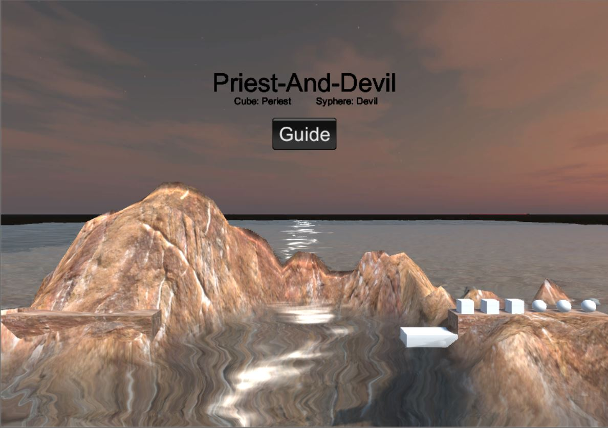

# Homework_3

Priests and DevilsV2.0(动作分离版本)

**[个人github](https://github.com/xwy27/Unity-3D-Learning)**

## Skybox

运用skybox，terrain 和 water environment 对牧师与魔鬼V1.0，即上一版本进行场景的美化(尽力去做的好看了)。



游戏对象的使用：
>游戏对象可以通过直接实例化使用，这样适用于一次的，无多共性的游戏对象;也可以通过预制来实例化，这种方式可以满足有着多数共性的游戏对象的实例化，不必每次都为具有共性的游戏对象赋值相同属性。
>
>游戏对象的位置是很重要的一个参数，对于这个参数的调整，类似于网页的 CSS 调整，往往需要耐心，才能调整出好看的场景。
>
>游戏对象可以赋值材质，Unity 对于 material 的渲染非常棒，针对不同的贴图，基本做到了全覆盖，不突兀，视觉效果较好。通过贴图，可以满足游戏对象较为简单的形象设计。比如 terrain 的地貌。
>
>总而言之，每一个游戏对象都有着其特定的功能，其特性都应被重视，不能草率了之。

## Priests and DevilsV2.0

关于动作分离，这个需求的产生，与 MVC 构架分离类似。我们的 GameObject 可以执行的动作，事实上是可以划分为许多相同的基础动作的，如直线运动，对话等。我们不可能在每个 GameObject 都写上他们的动作，所以，可以提取出基础动作，然后使用一个动作类和一个执行类去完成 GameObject 的动作，同时，配备一个动作管理者，让其去调度，谁去执行什么动作。

对于这个动作分离，我们从以下方面考虑：首先，动作分离，构建动作基类，然后继承实现基础动作类，接着实现动作执行类。  
但是对于每个 GameObject，其执行动作可能同一时刻有多个，所以可以构造一个动作队列执行类，让其执行队列中的所有动作。

还有一个问题，动作执行过程中，GameObject 应该是无法行动的，因为逻辑上其应该执行的动作，我们都加入到动作执行队列了。所以，我们需要防止这种意外情况发生。那么，动作回调就出现了。这个动作回调，就是在这个 GameObject 执行动作完毕后，通知其本身动作执行完毕，可以继续执行，或者通知其关联的 GameObject，动作执行完毕，它可以进行操作。

以上就是动作分离需要注意的事情。下面我们来看代码实现。

1. **动作基类**

动作的基类，定义有关于 GameObject 的动作内容。  
牧师与魔鬼游戏中，GameObject 的动作只涉及直线运动，所以，我们仅需要 Transform 属性，以便对 GameObject 指定直线运动的路径。  
其中 Start 和 Update 方法，是实现动作的基础函数，throw 语句是为了提醒用户实现这个接口。

```cs
public class SSAction : ScriptableObject {
    public bool enable = true;
    public bool destroy = false;

    public GameObject GameObject { get; set; }
    public Transform Transform { get; set; }
    public ISSActionCallback Callback { get; set; }

    public virtual void Start() {
        throw new System.NotImplementedException();
    }

    public virtual void Update() {
        throw new System.NotImplementedException();
    }
}
```

1. **基础动作**

动作基类定义完毕，开始定义我们的基础动作。分析 GameObject 可执行的动作可知，其基础动作仅有一个，那就是直线运动。所以，在这里我们使用Transform 属性来构造直线运动。

```cs
public class SSMoveToAction : SSAction {
    public Vector3 target;
    public float speed;

    private SSMoveToAction() { }

    public static SSMoveToAction GetSSMoveToAction(Vector3 target, float speed) {
        SSMoveToAction action = CreateInstance<SSMoveToAction>();
        action.target = target;
        action.speed = speed;
        return action;
    }

    public override void Start() { }

    public override void Update() {
        Transform.position = Vector3.MoveTowards(Transform.position, target, speed * Time.deltaTime);
        if (Transform.position == target) {
            destroy = true;
            Callback.ActionDone(this);
        }
    }
}
```

1. **组合动作**

组合动作，完成的就是一系列动作。在我们的游戏里，其实并没有这个需求，但是，上一版本中，不太成熟的折线运动则需要这个组合动作。这一次，我们的组合动作出现在人物动作上。其上下船/岸动作，抽象为一个直角折线运动。这时，就需要两步运动，所以，需要实现组合动作。

组合动作类需要实现的事情是在调用它的时候，加入动作队列，然后执行，执行完毕后，清空队列。

```sql
public class SequenceAction: SSAction, ISSActionCallback {
    public List<SSAction> sequence;
    public int repeat = -1;
    public int currentActionIndex = 0;

    public static SequenceAction GetSequenceAction(int repeat, int currentActionIndex, List<SSAction> sequence) {
        SequenceAction action = CreateInstance<SequenceAction>();
        action.sequence = sequence;
        action.repeat = repeat;
        action.currentActionIndex = currentActionIndex;
        return action;
    }

    public override void Update() {
        if (sequence.Count == 0) return;
        if (currentActionIndex < sequence.Count) {
            sequence[currentActionIndex].Update();
        }
    }

    public void ActionDone(SSAction source) {
        source.destroy = false;
        currentActionIndex++;
        if (currentActionIndex >= sequence.Count) {
            currentActionIndex = 0;
            if (repeat > 0) repeat--;
            if (repeat == 0) {
                destroy = true;
                Callback.ActionDone(this);
            }
        }
    }

    public override void Start() {
        foreach(SSAction action in sequence) {
            action.GameObject = GameObject;
            action.Transform = Transform;
            action.Callback = this;
            action.Start();
        }
    }

    void OnDestroy() {
        foreach(SSAction action in sequence) {
            DestroyObject(action);
        }
    }
}
```

1. 动作管理

动作管理，就是管理动作的执行，它来调度调配所有的动作的执行。

```cs
public class ActionManager : MonoBehaviour, ISSActionCallback {
    private Dictionary<int, SSAction> actions = new Dictionary<int, SSAction>();
    private List<SSAction> waitingAdd = new List<SSAction>();
    private List<int> waitingDelete = new List<int>();

    protected void Update() {
        foreach(SSAction action in waitingAdd) {
            actions[action.GetInstanceID()] = action;
        }
        waitingAdd.Clear();

        foreach(KeyValuePair<int, SSAction> kv in actions) {
            SSAction action = kv.Value;
            if (action.destroy) {
                waitingDelete.Add(action.GetInstanceID());
            } else if (action.enable) {
                action.Update();
            }
        }

        foreach(int key in waitingDelete) {
            SSAction action = actions[key];
            actions.Remove(key);
            DestroyObject(action);
        }
        waitingDelete.Clear();
    }

    public void AddAction(GameObject gameObject, SSAction action, ISSActionCallback callback) {
        action.GameObject = gameObject;
        action.Transform = gameObject.transform;
        action.Callback = callback;
        waitingAdd.Add(action);
        action.Start();
    }

    public void ActionDone(SSAction source) { }
}
```

1. 场记与动作管理

动作分离完毕，我们还需要对原始的代码进行少量的改动。由于使用了 MVC 改动就变得很有目的性了。前往 Controller 代码，将所有动作执行代码删去。然后再在场记处调用动作管理者，就好了。这样一来，代码的耦合度又降低了，在更改和 debug 的时候，指向性更强。

在这里，使用了一个场记动作管理者类，避免场记代码冗余。

```cs
public class FirstSceneActionManager : ActionManager {
    public void MoveBoat(BoatController boatController) {
        SSMoveToAction action = SSMoveToAction.GetSSMoveToAction(boatController.GetDestination(), boatController.boat.movingSpeed);
        AddAction(boatController.boat._Boat, action, this);
    }

    public void MoveCharacter(MyNamespace.CharacterController characterCtrl, Vector3 destination) {
        Vector3 currentPos = characterCtrl.character.Role.transform.position;
        Vector3 middlePos = currentPos;
        //采用线段式的折线运动
        //终点纵坐标小，则为从岸上船
        //否则，从船上岸
        if (destination.y > currentPos.y) middlePos.y = destination.y;
        else {
          middlePos.x = destination.x;
        }
        SSAction action1 = SSMoveToAction.GetSSMoveToAction(middlePos, characterCtrl.character.movingSpeed);
        SSAction action2 = SSMoveToAction.GetSSMoveToAction(destination, characterCtrl.character.movingSpeed);
        //动作队列完成上船或上岸动作
        SSAction seqAction = SequenceAction.GetSequenceAction(1, 0, new List<SSAction> { action1, action2 });
        AddAction(characterCtrl.character.Role, seqAction, this);
    }
}

```

更改后的 FirstController，主要改动动作执行代码，通过调用场记动作管理者实现。

```cs
public class FirstController : MonoBehaviour, ISceneController, IUserAction{
    //...
    public void MoveBoat() {
        if (boatCtrl.IsEmpty()) return;
        //修改船的移动动作和过程处理
        actionManager.MoveBoat(boatCtrl);
        boatCtrl.SetPos();
        UserGUI.status = CheckGameOver();
    }

    public void CharacterClicked(MyNamespace.CharacterController characterCtrl) {
        if (characterCtrl.character.IsOnBoat) {
            CoastController tempCoast = (boatCtrl.boat.Location == Location.right ? rightCoastCtrl : leftCoastCtrl);
            boatCtrl.GetOffBoat(characterCtrl.character.Name);
            actionManager.MoveCharacter(characterCtrl, tempCoast.GetEmptyPosition());
            characterCtrl.GetOnCoast(tempCoast);
            tempCoast.GetOnCoast(characterCtrl);
        } else {
            CoastController tempCoast = characterCtrl.character.Coast;
            if (tempCoast.coast.Location != boatCtrl.boat.Location) return;     // Boat at another side

            if (boatCtrl.GetEmptyIndex() == -1) return;                         // Boat is full

            tempCoast.GetOffCoast(characterCtrl.character.Name);
            actionManager.MoveCharacter(characterCtrl, boatCtrl.GetEmptyPosition());
            characterCtrl.GetOnBoat(boatCtrl);
            boatCtrl.GetOnBoat(characterCtrl);

        }
        UserGUI.status = CheckGameOver();
    }
    //...
}
```