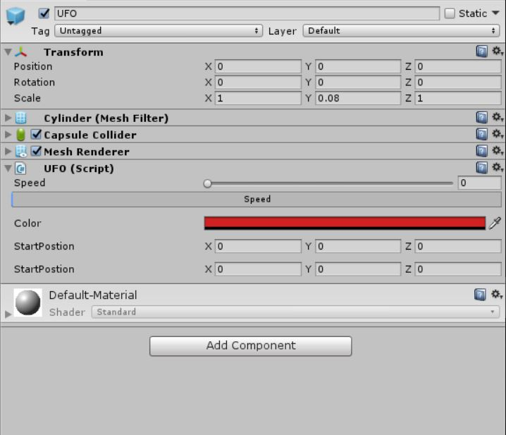

# UFO

[TOC]

简单的打飞碟游戏

**[Video 演示](http://www.iqiyi.com/w_19ryb0juc5.html)**

**[个人github](https://github.com/xwy27/Unity-3D-Learning)**

## 飞碟游戏

### 规则

1. 按下空格发射飞碟
1. 点击飞碟得分
1. 飞碟落地则扣分
1. 难度随次数增加

### 细节

#### 代码文件目录

+ Controller
    + Interface.cs  
        *Interfaces and Enum variables*
    + FirstSceneController.cs  
        *FirstController logic codes*
    + Scene.cs  
        *Scene and Score Controller*
    + UFOFactory.cs  
        *UFO controller for creating and recycling UFO*
    + UserAction.cs  
        *User click or space press controller*
+ Model
    + GameModel.cs  
        *Score model*
    + UFOModel.cs  
        *UFO model*
+ View
    + UI.cs  
        *Game hint, score and status presentation*

#### 游戏分解

游戏主体大致分为：飞碟，用户和分数。分别对三个主体继续细致划分，以达到架构目的。
+ UFO
    + Model (*Speed, Color, Position, Direction*)
        ```cs
        public class UFOModel {
            public Color UFOColor;
            public Vector3 startPos;
            public Vector3 startDirection;
            public float UFOSpeed;

            public void Reset(int round) {
                UFOSpeed = 0.1f;
                if (round % 2 == 1) {
                    UFOColor = Color.red;
                    startPos = new Vector3(-5f, 3f, -15f);
                    startDirection = new Vector3(3f, 8f, 5f);
                } else {
                    UFOColor = Color.green;
                    startPos = new Vector3(5f, 3f, -15f);
                    startDirection = new Vector3(-3f, 8f, 5f);
                }
                for (int i = 1; i < round; i++) {
                    UFOSpeed *= 1.1f;
                }
            }
        }
        ```
    + Controller (*(=UFOFactory) Create, Recycle*)
        ```cs
        public class UFOFactoryBase : System.Object {
            public GameObject UFOPrefab;

            private static UFOFactoryBase ufoFactory;
            List<GameObject> inUseUFO;
            List<GameObject> notUseUFO;

            private UFOFactoryBase() {
                notUseUFO = new List<GameObject>();
                inUseUFO = new List<GameObject>();
            }

            public static UFOFactoryBase GetFactory() {
                return ufoFactory ?? (ufoFactory = new UFOFactoryBase());
            }

            public List<GameObject> PrepareUFO(int UFOnum) {
                for (int i = 0; i < UFOnum; i++) {
                    if (notUseUFO.Count == 0) {
                        GameObject disk = Object.Instantiate(UFOPrefab);
                        inUseUFO.Add(disk);
                    } else {
                        GameObject disk = notUseUFO[0];
                        notUseUFO.RemoveAt(0);
                        inUseUFO.Add(disk);
                    }
                }
                return inUseUFO;
            }

            public void RecycleUFO(GameObject UFO) {
                int index = inUseUFO.FindIndex(x => x == UFO);
                notUseUFO.Add(UFO);
                inUseUFO.RemoveAt(index);
            }
        }
        ```
+ 用户
    + ActionController (*Click, Press space button*)
        ```cs
        public class UserAction : MonoBehaviour {
            public GameObject planePrefab;

            GameStatus gameStatus;
            SceneStatus SceneStatus;

            IUserInterface uerInterface;
            IQueryStatus queryStatus;
            IScore changeScore;

            // Use this for initialization
            void Start() {
                // Initialize
            }

            // Update is called once per frame
            void Update() {
                gameStatus = queryStatus.QueryGameStatus();
                SceneStatus = queryStatus.QuerySceneStatus();

                if (gameStatus == GameStatus.Play) {
                    if (SceneStatus == SceneStatus.Waiting && Input.GetKeyDown("space")) {
                        uerInterface.SendUFO();
                    }
                    if (SceneStatus == SceneStatus.Shooting && Input.GetMouseButtonDown(0)) {
                        Ray ray = Camera.main.ScreenPointToRay(Input.mousePosition);
                        RaycastHit hit;
                        if (Physics.Raycast(ray, out hit) && hit.collider.gameObject.tag == "UFO") {
                            uerInterface.DestroyUFO(hit.collider.gameObject);
                            changeScore.AddScore();
                        }
                    }
                }
            }
        }
        ```
+ 分数
    + StatusController (*Add, Subtract*)
        ```cs
        public class GameModel : IScore {
            public int Score { get; private set; }
            public int Round { get; private set; }
            private static GameModel gameModel;

            private GameModel() { Round = 1; }

            public static GameModel GetGameModel() {
                return gameModel ?? (gameModel = new GameModel());
            }

            public void AddScore() {
                Score += 10;
                if (CheckUpdate()) {
                    Round++;
                    FirstSceneControllerBase.GetFirstSceneControllerBase().Update();
                }
            }

            public void SubScore() {
                Score -= 10;
                if (Score < 0) {
                    FirstSceneControllerBase.GetFirstSceneControllerBase().SetGameStatus(GameStatus.Lose);
                }
            }

            public bool CheckUpdate() { return Score >= Round * 20; }

            public int GetScore() { return GameModel.GetGameModel().Score; }
        }
        ```

对于三者的交互请求，通过 FirstSceneController 和 Scene 来辅助管理，即实现用户按钮送飞碟，用户点击是否加分，是否扣分。

*参考了师兄博客对于刚体和鼠标射线的使用，尽力去构造 MVC 构架。*

## 自定义 Component

对于飞碟游戏中的飞碟，根据其 model，完成了一个 Unity 中 Inspector 的 Editor 的便捷操作界面，相当于自定义了一个 Component。

### **制作方法**

+ 在 Unity 项目的 Assets 文件夹中放入 UFOModel 代码文件
+ 新建一个 script，代码如下:
    ```cs
    [CustomEditor(typeof(UFO))]
    public class UFOEditor : Editor {
        public override void OnInspectorGUI() {
            var target = (UFO)(serializedObject.targetObject);
            target.UFOSpeed = EditorGUILayout.IntSlider("Speed", target.UFOSpeed, 0, 100);
            ProgressBar(target.UFOSpeed / 100.0f, "Speed");

            target.UFOColor = EditorGUILayout.ColorField("Color", target.UFOColor);

            //Blank Line
            EditorGUILayout.Space();
            target.startPos = EditorGUILayout.Vector3Field("StartPosition", target.startPos);

            //Blank Line
            EditorGUILayout.Space();
            target.startDirection = EditorGUILayout.Vector3Field("StartPosition", target.startDirection);
        }
        private void ProgressBar(float value, string label) {
            Rect rect = GUILayoutUtility.GetRect(18, 18, "TextField");
            EditorGUI.ProgressBar(rect, value, label);
            EditorGUILayout.Space();
        }
    }
    ```
+ 将代码挂在一个 GameObject 上，他的 Inspector 界面就有我们指定的操作界面了。
+ 制作预制，然后把刚才的 GameObject 拖到上面，这么一来，就完成了。

对于代码中各个 Editor 界面的控件，可以查阅 [官网](https://docs.unity3d.com/ScriptReference/Editor.html) 或者直接阅读 VS 上给出的提示。主要需要注意的就是整体的代码声明限制。

### **成品示意**

